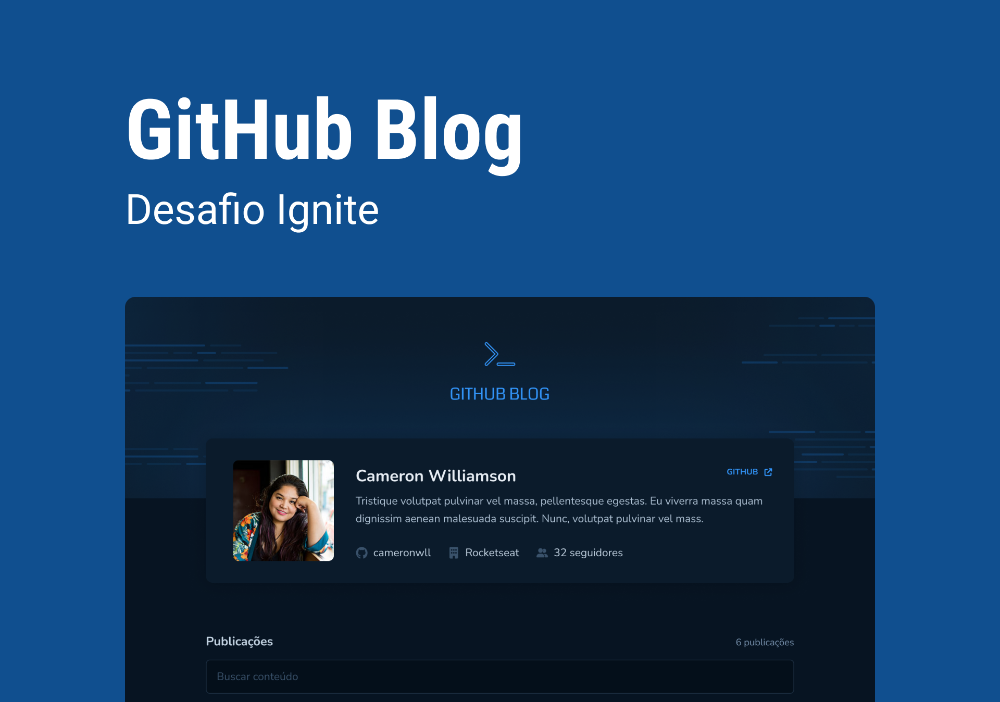

# Github Blog

Esta aplicação foi desenvolvida a partir do desafio do treinamento de ReactJS da Rocketseat, o desafio proposto foi desenvolver um blog com meus dados do perfil do Github, no qual eu teria que listar todas Issues do repositório selecionado, com opção de pesquisar as issues escrevendo o título da mesma. Para isso foi utilizado a ContextAPI para o gerenciamento de estado, [React Router](https://reactrouter.com/en/main) para criar rotas através de links e botões, [styled-components](https://styled-components.com/) foi utilizado para estilizar a aplicação e [Font Awesome](https://fontawesome.com/) para os ícones, [React Hook Form](https://react-hook-form.com/) foi utilizado para gerenciar o formulário, foi utilizado também o [ZOD](https://zod.dev/) para realizar a validação do formulário em integração com o React Hook Form, [AXIOS](https://axios-http.com/docs/intro) para requisições HTTP e para finalizar realizei a formatação do Markdown do conteúdo das issues para html com o auxílio das bibliotecas [react-markdown](https://github.com/remarkjs/react-markdown) e [remark-gfm](https://github.com/remarkjs/remark-gfm), além de adicionar testes unitários com o [VITEST](https://vitest.dev/), [Testing Library](https://testing-library.com/) e [MSW](https://mswjs.io/). Algo que venho utilizando bastante é a biblioteca da rocketseat [eslint-config-rocketseat](https://github.com/rocketseat/eslint-config-rocketseat) com uma boa configuração ESlint.

#### Plus +

- Responsividade (Mobile First)
- Teste com [VITEST](https://vitest.dev/) e [@testing-library](https://testing-library.com/)
- Mock com [MSW](https://mswjs.io/)
- [date-fns](https://date-fns.org/) para formatar a data de criação das issues

### Funcionalidades:

- Listagem do seu perfil com imagem, número de seguidores, nome e outras informações disponíveis pela API do GitHub.

- Listar e filtrar todas as issues do repositório com um pequeno resumo do conteúdo dela.

- Criar uma página para exibir um post (issue) completo


### Foi praticado os conceitos como:

- Fetch / Axios (Requisições HTTP)
- Roteamento e React Router DOM
- Formulários
- Context API
- Gerencimento de estados (useState)

## Tecnologias Utilizadas


## Inicializar a aplicação:


Caso tenha interesse em clonar o repositório favor seguir as seguites instruções:

Criar um arquivo .env.local com o seguinte código no qual você pode inserir seu próprio perfil no github e respositório selecionado da sua escolha
```javascript
# your username github "camposweb"
VITE_APP_USERNAME="camposweb"

# Your respositorie "ignite-trilha2022-desafio03-github-blog"
VITE_APP_REPOSITORIE="ignite-trilha2022-desafio03-github-blog"
```

Para inicializar a aplicação utilizar os comandos
```javascript
npm install
npm run dev

	or

yarn install
yarn dev
```

## A aplicação está hospedada na Vercel
[https://ignite-trilha2022-desafio03-github-blog.vercel.app/](https://ignite-trilha2022-desafio03-github-blog.vercel.app/)


